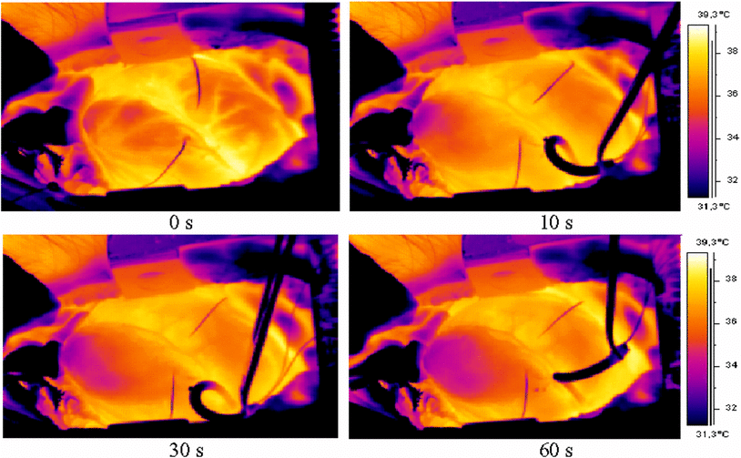
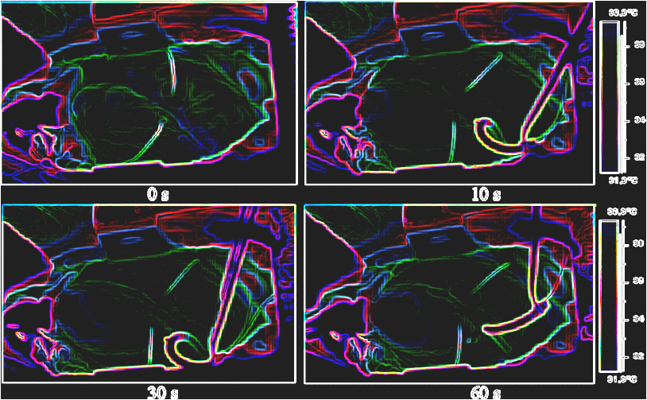

# Edge Detection Using the Sobel Operator

## Project Objective

The goal of this project is to develop software for detecting edges in an image (24-bit bitmap) using the Sobel operator. This method is part of digital image processing, often used in applications like thermography.

### Example 1
Figure 1 shows a thermogram of an induced heart attack in a domestic pig. The example program detects edges in the image using the Sobel operator and saves the resulting image as a 24-bit bitmap (the same format as the input file). Figure 2 shows the resulting image after edge detection.

|  | 
|:--:| 
| *Figure 1*: Thermogram of a heart attack in a domestic pig. |

|  | 
|:--:| 
| *Figure 2*: Image from Figure 1 after edge detection using the Sobel operator. |

## Useful Information

### The Sobel Operator
The Sobel operator is used for edge detection in digital images. It is a discrete differentiation operator that approximates directional derivatives of image intensity in eight directions at 45° intervals. Directional derivatives are calculated via the convolution of the pixel array with a 3x3 mask specific to a given direction. 

#### Directional Masks
The Sobel operator uses 8 characteristic masks to detect edges at angles between 0° and 315°:

- **0°:** Vertical edges  
- **45°:** Diagonal edges  
- **90°:** Horizontal edges  
- **135°:** Diagonal edges  

### Convolution Operation
Convolution calculates the value of each pixel in the output image as the sum of the products of the mask elements and the pixel values covered by the mask. The mask "slides" across the pixel array row by row. 

#### Edge Detection Steps
1. Perform convolution for all 8 masks.
2. Average the results:
image(x, y) = (1/8) * Σ image_k(x, y) for k = 1 to 8

For color images, apply edge detection independently to each RGB component.

## BMP Format

### Structure
The BMP format consists of:

1. File Header (`BITMAPFILEHEADER`) - 14 bytes  
2. Image Header (`BITMAPINFOHEADER`)  
3. Optional RGB palette  
4. Image Data  

#### BMP File Header (`BITMAPFILEHEADER`)
| Field Name     | Size (bytes) | Description                                |
|---------------|--------------|--------------------------------------------|
| bfType        | 2            | File signature, 'BM' for valid BMP files  |
| bfSize        | 4            | Total file size in bytes                  |
| bfReserved1   | 2            | Reserved (usually 0)                      |
| bfReserved2   | 2            | Reserved (usually 0)                      |
| bfOffBits     | 4            | Offset to image data                      |

#### BMP Image Header (`BITMAPINFOHEADER`)
| Field Name         | Size (bytes) | Description                           |
|--------------------|--------------|---------------------------------------|
| biSize            | 4            | Size of the information header        |
| biWidth           | 4            | Image width in pixels                 |
| biHeight          | 4            | Image height in pixels                |
| biPlanes          | 2            | Number of planes (must be 1)          |
| biBitCount        | 2            | Bits per pixel (1, 4, 8, 16, 24, 32)  |
| biCompression     | 4            | Compression algorithm (e.g., BI_RGB) |
| biSizeImage       | 4            | Image size in bytes                   |
| biXPelsPerMeter   | 4            | Horizontal resolution                 |
| biYPelsPerMeter   | 4            | Vertical resolution                   |
| biClrUsed         | 4            | Number of colors in palette           |
| biClrImportant    | 4            | Number of important palette colors    |

### Color Palette
The color palette follows the `BITMAPINFOHEADER` if present. For 24-bit images, no palette is defined, and image data directly follows the headers.

### Image Data
In 24-bit BMP files, each pixel is represented by 3 bytes (BGR order). The data is stored in reverse order (bottom to top).

For example, a BMP file with dimensions:
- **Width**: 3 pixels
- **Height**: 5 pixels
- **Size**: 60 bytes

The rows are padded to a multiple of 4 bytes. For this example, each row uses 12 bytes (9 bytes for data + 3 padding bytes).
